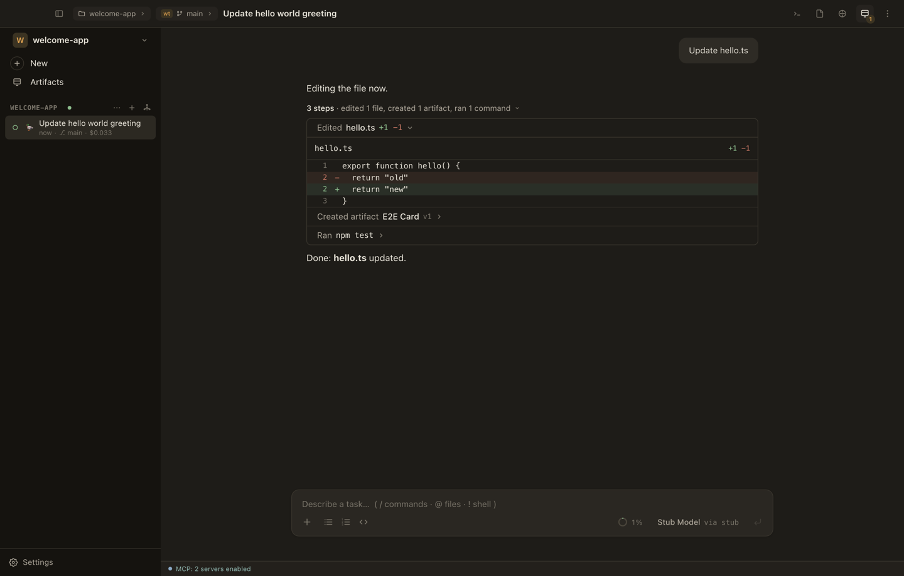
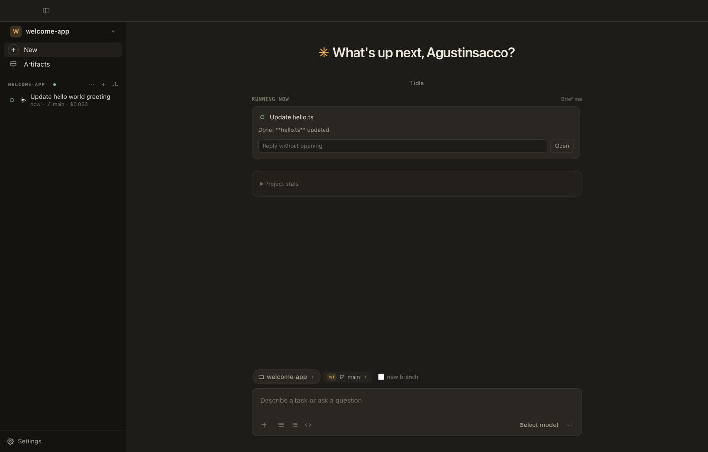
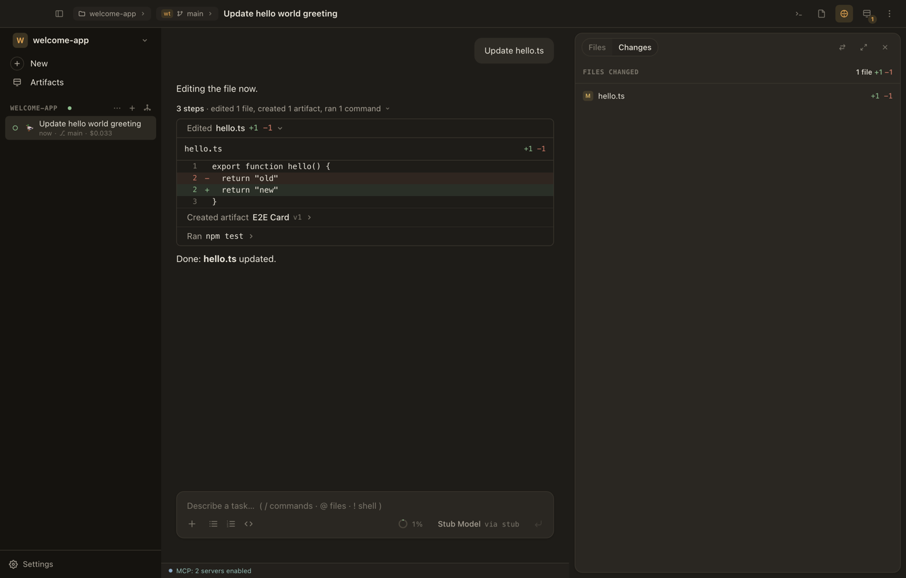
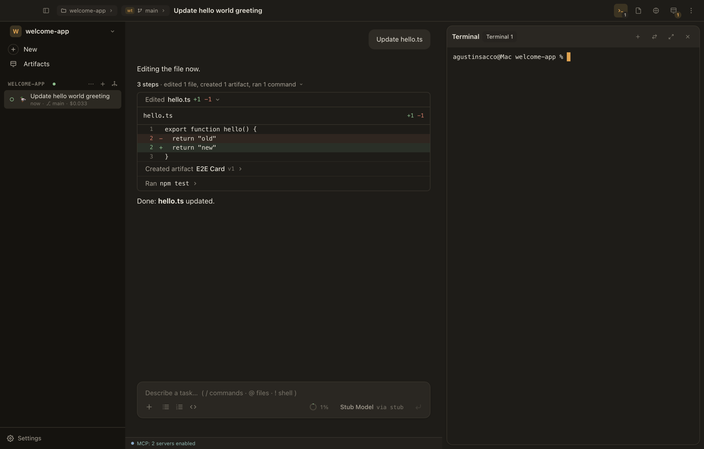
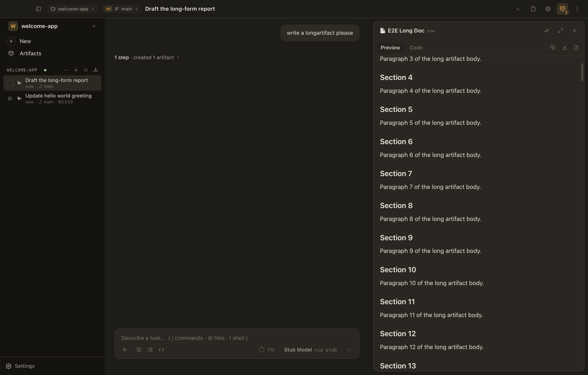
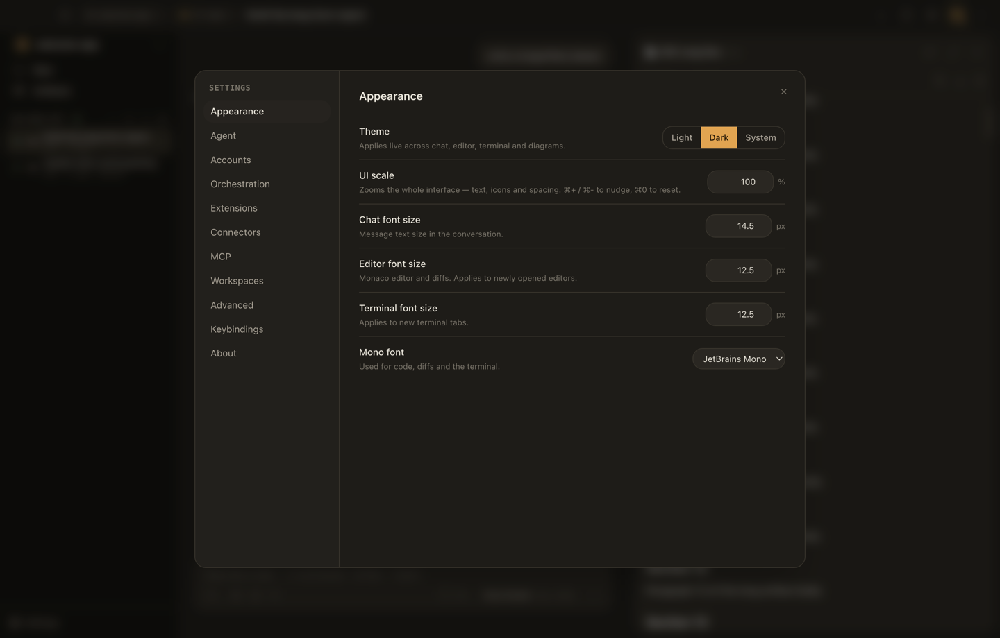
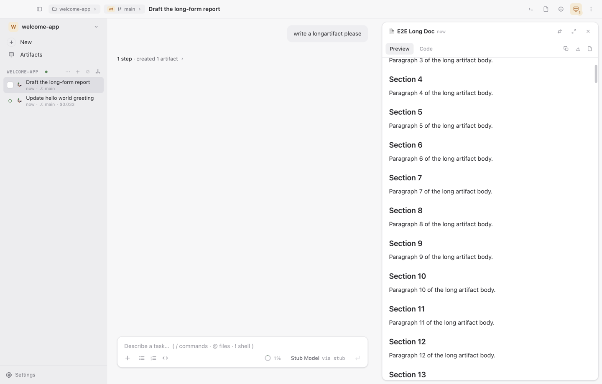
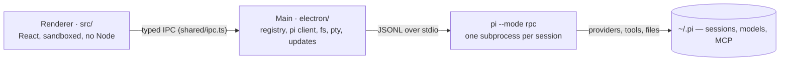

<picture>
  <source media="(prefers-color-scheme: dark)" srcset="build/icon.svg">
  <source media="(prefers-color-scheme: light)" srcset="build/icon-light.svg">
  
</picture>

# pidex

**A desktop coding-agent app for macOS, Linux and Windows, powered entirely by
the [pi coding agent](https://www.npmjs.com/package/@earendil-works/pi-coding-agent).**

[](https://github.com/agustinsacco/pidex/actions/workflows/ci.yml)
[](https://github.com/agustinsacco/pidex/releases/latest)
[](https://github.com/agustinsacco/pidex/releases)


Open a project folder, describe a task, and work alongside the agent — with a
chat that renders what models actually produce (diffs, diagrams, charts,
sandboxed HTML), the file explorer and terminal next to it, and every change the
agent made available to review or revert.

|                                             |                                        |
| ------------------------------------------- | -------------------------------------- |
| **Chat, diffs, files, terminal, artifacts** | One window, side by side               |
| **Sessions are real pi processes**          | Nothing invented, everything reachable |
| **Runs on your metal**                      | Your models, your keys, your files     |



## What pidex does

- **Sessions are real pi subprocesses.** One `pi --mode rpc` per live session,
  spawned in the workspace folder. Everything pi exposes over RPC is reachable
  from the UI — models, thinking levels, steering and follow-up queues,
  compaction, auto-retry, forks, clones, session export.
- **No permission prompts.** pi runs in full-permission mode; tool calls execute
  and stream their results.
- **Rich responses are first-class.** GFM markdown, syntax-highlighted code,
  mermaid diagrams, Chart.js and Vega-Lite specs, KaTeX math, and model-authored
  HTML rendered in a sandboxed iframe.
- **Every change is reviewable.** The Changes panel accumulates the agent's
  edits with per-file diffs against a session baseline, and per-file revert.
- **Session tree.** Visualize the branch structure of a session, jump to any
  point, fork from it, or bookmark it.
- **Artifacts.** A bundled pi extension adds `artifact_create` /
  `artifact_edit` / `artifact_update` tools; substantial deliverables land in a
  versioned side panel with previews and diffs between versions, and survive app
  restarts via session replay.
- **An orchestrator that manages sessions.** One orchestrator session per
  project plus a zero-inference hub that shows what every live session is doing.
  Its mode — `observe`, `supervise`, `autopilot` — is enforced in the bridge at
  call time. See
  [specs/reference/orchestration.md](specs/reference/orchestration.md).
- **Your machine, your models.** Sign in to providers, pick models, set themes,
  and mount MCP servers from Settings. MCP OAuth is owned by the adapter, never
  by pidex: [specs/reference/mcp.md](specs/reference/mcp.md).

## The screens

### Home — mission control

The home screen greets you with what is running, a brief, project stats, and a
composer that starts a session in the folder and branch you pick. Every card is
a projection of what main sees in pi's event stream, and each one can be
answered without opening the session.



### Chat — the transcript, not a blob

Streaming assistant text with the run's activity folded into steps: file edits
expand to their diff, tool calls to their arguments and output, thinking to its
own block. The composer takes `@` file references, `/` commands, `!` shell
lines, and queues follow-ups while a turn is running.



### Files and terminal, switched in beside the chat

A file explorer with a Monaco editor for the file you pick, and real terminal
tabs running against the workspace. Both are switches in the session's top bar,
keyed per workspace, so the transcript never loses its place.



### Artifacts

Long-form documents, HTML pages, SVG, mermaid and chart documents the model
creates for you — versioned, previewable, diffable, and reconstructed from the
session on reopen.



### Settings — and it is not only dark

Eleven tabs: appearance (theme, UI scale, fonts), agent, accounts, orchestration,
extensions, connectors, MCP, workspaces, advanced, keybindings, about. Light
theme included, because diff review at 2am is a real workflow.



The light theme, on the same session — because diff review at 2am is a real
workflow.



## Install

macOS and Linux:

```bash
curl -fsSL https://github.com/agustinsacco/pidex/releases/latest/download/install.sh | sh
```

The script installs the AppImage on Linux and the `.app` bundle on macOS,
verifying the download against the release's `checksums.txt`. Binaries are also
on the [Releases page](https://github.com/agustinsacco/pidex/releases) — DMG and
ZIP for macOS, AppImage and `.deb` for Linux.

Windows builds are produced by the tagged `Release` workflow rather than the
per-merge one, so a `.exe` is only present on releases that were cut from a `v*`
tag.

pidex needs `pi` on your PATH:

```bash
npm install -g @earendil-works/pi-coding-agent
```

The app shows a setup screen until pi is available. Sign in to a provider by
running `pi` in pidex's built-in terminal and using `/login`, or configure API
keys / a local endpoint in `~/.pi/agent/`.

### Updates

Every merge to `main` that passes CI publishes a new release, versioned
`0.1.<commit count>`. An installed app checks for one at launch and every 30
minutes after; when it finds one, an update button appears in the sidebar
footer, just above Settings.

Linux AppImage and signed macOS installs download in the background and offer
"Restart to update". Unsigned macOS and `.deb` installs cannot replace their own
files, so they link to the release page instead. Update checks are disabled
entirely in development builds — they only run when packaged.

## How it works

One `pi --mode rpc` subprocess per live session, spoken to over JSONL on stdio.
pidex never imports pi's code: the protocol is hand-mirrored in
[`shared/rpc.ts`](shared/rpc.ts) with compile-time drift guards, so a change to
pi's protocol that this file hasn't caught won't compile.



Six facts that explain the rest:

1. **The main process owns all side effects.** The renderer runs sandboxed
   (`contextIsolation`, no Node) and is pure UI over typed IPC. If a feature
   needs disk, network, or a subprocess, it goes in `electron/`, not `src/`.
2. **IPC is a typed contract.** A new channel is an entry in `shared/ipc.ts`'s
   `IpcInvokeMap`, a handler in the `electron/ipc/<prefix>-handlers.ts` module
   matching the prefix, and a case in `src/dev/mockPidex.ts`.
3. **Stores (`src/stores/`) are projections of main-process state**, not a second
   source of truth. The zustand chat store is what keeps a session's live title,
   tokens, and context meter honest while a turn is running.
4. **Sessions are files.** pi writes a session's JSONL when a turn _ends_; the
   sessions list is a scan of pi's session directory. pidex also appends to those
   files for bookmarks, branch jumps and forks — which is only safe while no pi
   process owns the file, and call sites enforce that by convention.
5. **Six extensions run inside pi's process** (`pi-ext/`, loaded with `-e`):
   five bundled into every session (`artifacts`, `context-breakdown`,
   `mcp-status`, `tool-name-guard`, `worktree-paths`) plus `orchestrator`, only
   on orchestrator sessions. Two of them can change or refuse what the model
   did — read
   [specs/reference/extensions.md](specs/reference/extensions.md) first.
6. **Failure is reported, not hidden.** Failures surface on the session's chat;
   main-process detail goes to `pidex.log`. When diagnosing a bad session,
   [CLAUDE.md](CLAUDE.md#debugging-a-failing-session) has the three layers of
   evidence and the one command that decides pidex-vs-pi.

## Development

Requires Node 22+ (pi itself requires Node ≥ 22.19) and `pi` on PATH for
`npm run dev`.

```bash
npm install
npm run dev
```

| Script              | Purpose                                                        |
| ------------------- | -------------------------------------------------------------- |
| `npm run dev`       | Electron + Vite dev server with HMR                            |
| `npm run dev:web`   | Renderer alone, in a browser, against the mock preload API     |
| `npm run build`     | Bundle main, preload and renderer to `out/`                    |
| `npm run typecheck` | TypeScript project checks (main + renderer)                    |
| `npm run lint`      | ESLint                                                         |
| `npm run format`    | Prettier                                                       |
| `npm test`          | Vitest unit tests                                              |
| `npm run test:e2e`  | Playwright-Electron smoke tests against the deterministic `pi` |
| `npm run validate`  | All of the above, quiet — one PASS/FAIL line per step + a log  |
| `npm run pack`      | Package for the current platform without packing (quick check) |
| `npm run dist`      | Package for the current platform via electron-builder          |
| `npm run shots`     | Re-shoot the screenshots in this README (see below)            |

Tests live beside their subject as `*.test.ts`, in `electron/`, `shared/` and
`pi-ext/` included.

**Conventions** (IPC channels, the `piCall` rule, modals, and the sharp edges
worth knowing before you touch pi's session files) live in
[CLAUDE.md](CLAUDE.md). It is written for coding agents, but it is the shortest
accurate orientation for a human too.

### The screenshots in this README

They are real captures of the app, not mockups — and they are reproducible:

```bash
npm run build && npm run shots
```

The runner (`scripts/capture-readme-shots.mjs`) launches the built app against a
scratch git workspace and drives it with the same deterministic `pi` stub the CI
end-to-end suite uses, so the captures are deterministic too. That is also why
the model chip reads _Stub Model_: the screenshots are of the app, not of a
metered model run. `ONLY=chat,changes node scripts/capture-readme-shots.mjs`
re-shoots a subset.

### Repo layout

This tree is the single source of truth for "what lives where". `CLAUDE.md` and
[specs/reference/architecture.md](specs/reference/architecture.md) link here
rather than keeping their own copies — there used to be three, and all three had
drifted.

```
electron/            main process — owns every side effect
  main.ts            app lifecycle, window creation, quit teardown
  preload.ts         the contextBridge surface (one typed `subscribe` helper)
  ipc.ts             composition root: calls the per-domain handler registrars
  ipc/               one module per channel-prefix family — 14 of them today
                     (app, claude-auth, clipboard, fs, git, mcp, orchestrator,
                      packages, pi-auth, pi-config, pi-session, pty, sessions,
                      updates) plus handle.ts, the envelope unwrapper. The
                     contract lives in shared/ipc.ts; ipc.ts is the composition
                      root, so a handler module never imports it back.
  registry.ts        the live pi session registry
  pi/                RPC client (strict LF JSONL framing), session scanner,
                     writer, paths, print mode, model catalogue, login flow
  pty/               node-pty manager + spawn-helper repair
  fs/                file service, git layer (git-exec/info/sync/worktrees),
                     workspace watcher
  orchestrator/      the per-project orchestrator session and the fleet hub
  updates/           update check + download state machine
  store.ts           app prefs (electron-store, constructed lazily)
shared/              types and pure logic shared by main + renderer
  ipc.ts             the typed IpcInvokeMap contract
  rpc.ts             hand-mirrored copy of pi's RPC protocol + drift guards
  models.ts          model catalogue and orchestration types
src/                 renderer (React) — pure UI over typed IPC
  app/               shell: App, TopBar, workspace picker, global shortcuts
  features/          one folder per surface: chat, sessions, files, terminal,
                     artifacts, settings, home, orchestrator, worktrees,
                     workspaces, palette, updates, connectors, extension-ui
  components/        cross-feature primitives (Modal, PopupMenu, form, icons,
                     markdown renderers)
  stores/            zustand stores — projections of main-process state
  lib/               framework-free helpers (format, path, rpc, fuzzy, time…)
  styles/            the Phosphor design tokens
  dev/               browser-only mock of the preload API (never bundled)
pi-ext/              the six pi extensions that run inside pi's process:
                     artifacts, context-breakdown, mcp-status, tool-name-guard
                     and worktree-paths (bundled into every session), plus
                     orchestrator (orchestrator sessions only)
e2e/                 Playwright-Electron smoke tests + deterministic pi stub
scripts/             install.sh, icon + screenshot generation, release and
                     validate helpers
specs/               specifications, split by genre — see specs/README.md
docs/img/           the screenshots above (assets, not documentation)
```

The main process owns all side effects. The renderer runs with
`contextIsolation`, no Node integration, and a strict CSP; model-authored HTML
only ever renders inside a sandboxed iframe.

## Documentation map

| Read                                 | When                                                       |
| ------------------------------------ | ---------------------------------------------------------- |
| [CLAUDE.md](CLAUDE.md)               | Orientation, conventions, sharp edges, debugging           |
| [specs/README.md](specs/README.md)   | Which spec folder is a live contract and which is history  |
| [specs/reference/](specs/reference/) | The current contract (architecture, orchestration, MCP, …) |
| [specs/TRACKER.md](specs/TRACKER.md) | Phases and their logs                                      |
| [specs/log/](specs/log/)             | Dated notes on what changed and why                        |

A `build/` folder is a dated design doc; reading one as current is how stale
conclusions survive. `reference/` is the live contract.

## Contributing

Issues and PRs are welcome. Run `npm run validate` before opening a PR, and
write a `specs/log/` note for a substantial feature or refactor.

## License

MIT
