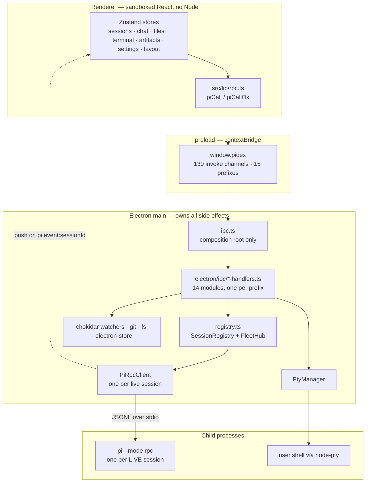
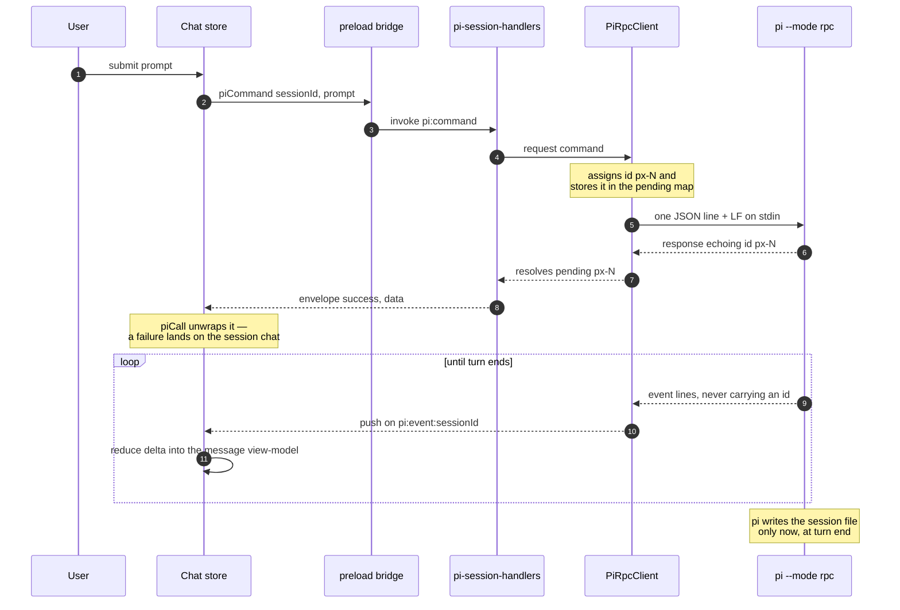

# 01 — Architecture

## Locked technical decisions

| Area                 | Decision                                                                                         |
| -------------------- | ------------------------------------------------------------------------------------------------ |
| Shell                | Electron (current stable), TypeScript everywhere, strict mode                                    |
| Renderer             | React 18+, Vite, Tailwind CSS                                                                    |
| State                | Zustand (per-domain stores); no Redux                                                            |
| Code viewing/editing | Monaco Editor (also provides the diff editor)                                                    |
| Terminal             | xterm.js + node-pty (real PTY, user shell, full interactivity)                                   |
| Markdown             | Streaming-tolerant pipeline (react-markdown + remark-gfm class) with Shiki or highlight.js       |
| Diagrams             | Mermaid, client-side                                                                             |
| Math                 | KaTeX                                                                                            |
| Charts               | Fenced chart specs (`vega-lite / `chart JSON) via vega-lite or Chart.js                          |
| HTML preview         | Sandboxed `<iframe sandbox>`, Code/Preview toggle                                                |
| File watching        | chokidar (main process)                                                                          |
| Packaging            | electron-builder → macOS (dmg+zip, arm64+x64), Linux (AppImage+deb), Windows (nsis)              |
| Install              | GitHub Releases + `curl … install.sh \| sh` (see [10-packaging.md](specs/build/10-packaging.md)) |
| IPC                  | Typed contextBridge preload; renderer never touches Node APIs                                    |
| pi integration       | RPC subprocess, one `pi --mode rpc` per live session ([02-pi-integration.md](pi-integration.md)) |

## Process model

Three kinds of process. The main process owns every side effect; the renderer
is pure UI over a typed bridge; pi and the user's shell run as children.

- **Main owns all side effects**: pi subprocesses, PTYs, filesystem, git,
  watchers, dialogs, app prefs. A feature needing any of those lives in
  `electron/`, not `src/`.
- **Renderer is pure UI.** `contextIsolation: true`, `nodeIntegration: false`,
  sandbox on, strict CSP. Model-authored HTML renders only in the sandboxed
  iframe served over `pidex-artifact://`.
- **`registry.ts` is deliberately not `ipc.ts`.** The handler modules need the
  live-session registry, and importing their own composition root to get it
  would be a cycle.
- **Idle sessions are not processes.** The sidebar is built by scanning pi's
  session files on disk; only a session you have open holds a subprocess.

### The IPC surface

Request/response uses `invoke`; streams are pushed from main. Every channel is
declared in [`shared/ipc.ts`](../shared/ipc.ts) — 130 invoke channels across 15
prefixes, each backed by the handler module matching its prefix.

| Prefix        | Ch. | Prefix        | Ch. | Prefix           | Ch. |
| ------------- | --- | ------------- | --- | ---------------- | --- |
| `app:*`       | 28  | `git:*`       | 19  | `pi:*`           | 20  |
| `sessions:*`  | 10  | `mcp:*`       | 10  | `orchestrator:*` | 9   |
| `fs:*`        | 9   | `packages:*`  | 7   | `pty:*`          | 5   |
| `claude:*`    | 4   | `gh:*`        | 3   | `updates:*`      | 3   |
| `artifacts:*` | 1   | `clipboard:*` | 1   | `fleet:*`        | 1   |

Push channels are the exception to request/response: `pi:event:<sessionId>`
(per live session, built by `sessionEventChannel`), plus `fleet:state`,
`updates:state` and `updates:event`.

### One streamed prompt, end to end

The response to `prompt` and the stream it produces are two different
mechanisms. The command is correlated by `id` and resolves once; the turn's
content arrives afterwards as uncorrelated events.

Two consequences worth holding onto:

- **A protocol error is data, not an exception.** `request()` resolves with
  `{success: false}` and rejects only when the transport is broken. That is why
  every renderer call goes through `piCall`/`piCallOk` — calling
  `window.pidex.piCommand` directly means owning the error branch, and half the
  original call sites forgot.
- **Nothing reaches disk mid-turn.** A name set during a turn is not in the
  session file until the reply lands, so every surface showing a live session's
  title prefers the chat store over the disk scan.

## Repo layout

**See the tree in [the README](../README.md#repo-layout).** It used to be
duplicated here; the copy drifted (it named a `types/ipc.ts` that never existed,
listed 6 of 13 feature folders, and 2 of 5 pi extensions), so this section is a
pointer now.

## Cross-cutting requirements

- Single source of truth for session state lives in main (registry of live sessions ↔ pi children); renderer stores are projections.
- All long/streaming output is incrementally reduced — never rebuild whole message arrays per delta.
- Every feature works on macOS, Linux, Windows (path handling via `node:path`, PTY shells per-OS: `$SHELL` / PowerShell).
- App prefs (theme, layout, workspaces, font size) in electron-store — never written into pi's config files. pi config editing is explicit and user-initiated ([09-settings.md](settings.md)).
