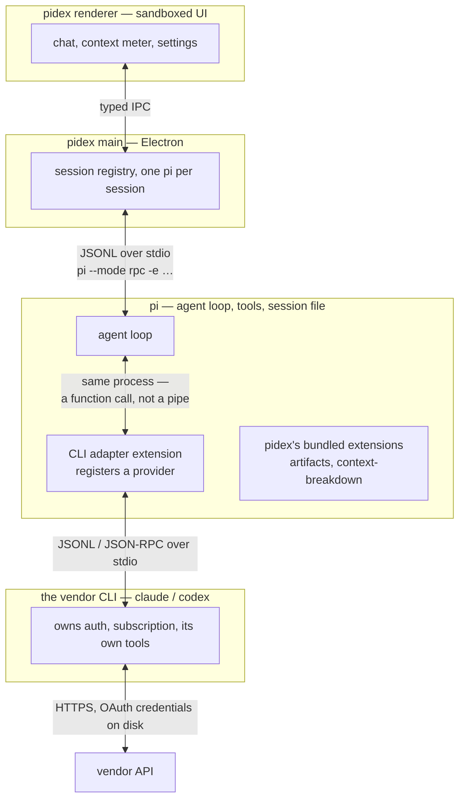
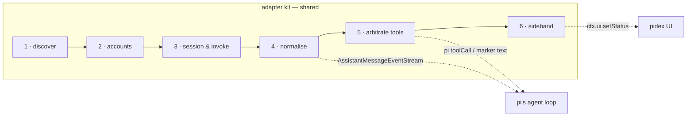
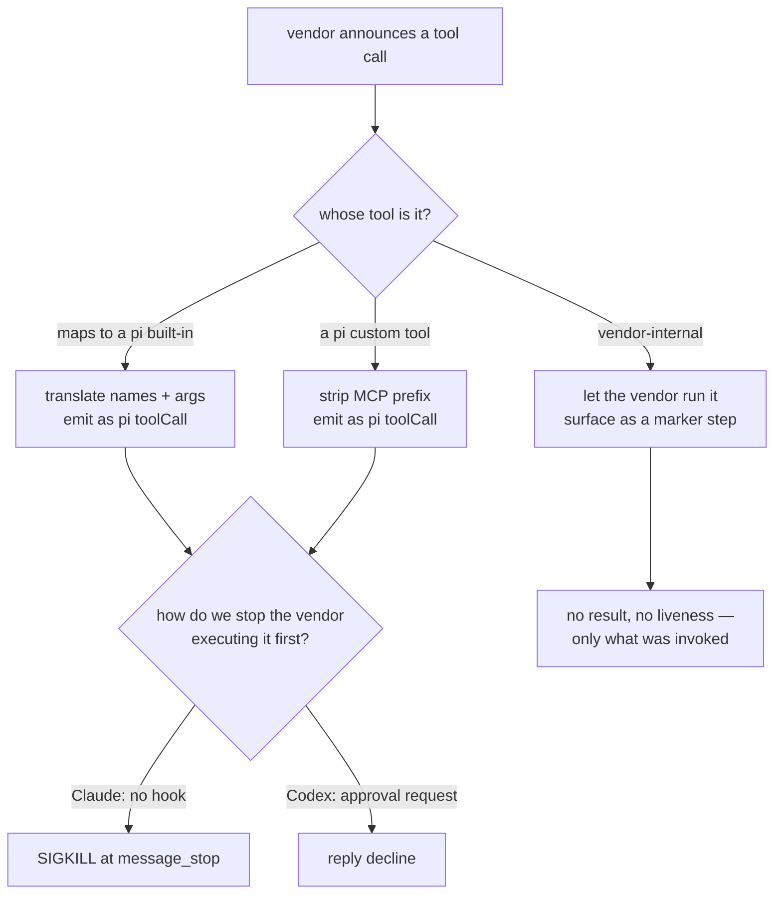

# 14 — Subscription CLIs as pi providers

pidex reaches paid coding agents through their **own CLIs**, using the user's
OAuth subscription instead of an API key. The first one shipped
(`@saccolabs/pi-claude-cli`, Claude Code). This spec generalises what that
taught us into a pattern that a second and third CLI can be built against,
and records what the OpenAI Codex CLI investigation found.

Status: the Claude adapter is **shipped and live-verified**. Codex CLI claims
are **derived from published documentation, not from a running binary** —
`codex` is not installed in this workspace.

**Read §1a before planning anything.** Whether a bridge is required at all is
a vendor-policy question, not a technical one, and the two vendors answer it
in opposite directions.

---

## 1. Why this shape at all

### 1a. The policy gate decides the architecture

Both vendors sell a subscription and both ship an OAuth flow. Only one of
them lets a third-party client use it. This single fact determines whether a
provider needs a CLI bridge or nothing at all.

| Vendor        | Borrowing the subscription's OAuth token in your own client                                                 | Therefore                                              |
| ------------- | ----------------------------------------------------------------------------------------------------------- | ------------------------------------------------------ |
| **Anthropic** | **Prohibited.** Terms updated Feb 2026; server-side blocks since 9 Jan 2026; billing enforcement 4 Apr 2026 | The official binary is the only path → **bridge**      |
| **OpenAI**    | **Explicitly permitted**, pi named by the Codex lead as a supported client (21 Aug 2026)                    | Native provider is the sanctioned path → **no bridge** |

Note the column heading carefully. What Anthropic prohibits is **token
extraction** — lifting a Free/Pro/Max OAuth credential into a client that is
not Claude Code. It does **not** prohibit third-party software from driving
the official binary; Anthropic's own help pages name `claude -p` and
"third-party app usage" as supported ways to spend a subscription, and their
GitHub Actions and GitLab CI integrations are built on exactly that. The
bridge has been on the supported side of this line the whole time.

OpenAI's position, from Codex lead Tibo Sottiaux: _"You are completely fine
if you use your subscription through Sign in With ChatGPT, either through the
official clients or through one of the many OSS clients (Pi, OpenCode, …)
that support signing in with your account and using your included usage."_
What gets flagged is sub2api — reselling a personal subscription as shared
API traffic. That is not what pi does.

Anthropic's position is the mirror image: OAuth from Free/Pro/Max accounts is
for Claude Code and claude.ai only, and using it elsewhere breaches the
Consumer Terms. The tokens are also blocked server-side, so it is not merely
a paper rule — pi's built-in `anthropic` OAuth provider cannot serve a Max
plan even if you are willing to ignore the terms.

**So `pi-claude-cli` is not one option among several. It is the only way to
reach a Claude subscription from pidex**, precisely because it delegates to
the official client rather than borrowing its credentials. That is a stronger
justification than the "we want Claude Code's harness" argument an earlier
draft of this spec gave, and it is the one to keep.

### 1b. The shape that follows

A subscription CLI is not an API. It is an agent that happens to expose a
machine-readable mode. Bridging one means asking it to be less than it is:
we want the model, the subscription and the reasoning — and we want pi to
keep the loop, the tools and the transcript.

The load-bearing decision is that the adapter is **a pi extension, not a
pidex feature**. It registers a provider inside pi's process. pidex learns
nothing; `shared/rpc.ts` did not change once for the entire Claude effort.



Two lifetimes, and they differ on purpose: **the pi subprocess lives for the
session; the vendor CLI process lives for one turn** (Claude) or for one
workspace (Codex app-server). Continuity across turns is the vendor's own
session store, reached by id — never a held-open pipe.

---

## 2. What the Claude adapter actually does

Verified against `@saccolabs/pi-claude-cli` 0.4.6 and live runs.

| Concern            | How it is solved                                                                                                              |
| ------------------ | ----------------------------------------------------------------------------------------------------------------------------- |
| Invocation         | `claude -p --input-format stream-json --output-format stream-json --verbose --include-partial-messages`, one process per turn |
| Prompt             | Full flattened history on turn 1; after that `--resume <id>` plus only the messages after the last **assistant** message      |
| Reasoning          | `thinking` blocks materialised lazily — fable-5 / opus-5 / sonnet-5 stream encrypted thinking with empty text deltas          |
| Multi-cycle        | One run is N API cycles; wire `content_block` indexes reset each cycle, so every block carries its own `contentIndex`         |
| Tool arbitration   | pi-known tools → translate, emit as pi `toolCall`, **SIGKILL at `message_stop`** before the CLI can execute them              |
| pi's custom tools  | Advertised to the CLI through a **schema-only MCP server** in a temp `--mcp-config`; never actually callable                  |
| CLI-internal tools | Emitted as `[Claude Code · Name {args}]` text — a wire contract pidex parses into activity rows                               |
| Account state      | `rate_limit_event` → `ctx.ui.setStatus("claude-rate-limit", json)`, never into turn content                                   |
| Isolation          | `PI_CLAUDE_CLI_HERMETIC=1` → `--strict-mcp-config --setting-sources ""`                                                       |
| Account selection  | `CLAUDE_CONFIG_DIR` — verified to isolate accounts completely                                                                 |

The two things that cost the most to learn, and that generalise:

- **Episodes are not messages.** Any agentic CLI loops internally before it
  answers. Index re-basing is not a Claude quirk; assume it everywhere.
- **The resume anchor is load-bearing.** Anchoring the delta on the last
  _user_ message replays the whole transcript once per tool iteration. The
  regression test is one sentence: _delta size must stay flat as the tool
  loop deepens._

---

## 3. What the Codex CLI offers

`@openai/codex`, current npm version **0.149.0**. Two machine-readable
surfaces, and they are not equivalent.

### 3a. `codex exec --json` — the close analogue

A per-invocation JSONL stream, structurally similar to Claude's stream-json.

```
thread.started    { "type":"thread.started", "thread_id":"<uuid>" }
turn.started
item.started   |  item.updated  |  item.completed   { "item": { … } }
turn.completed    { "usage": { "input_tokens", "cached_input_tokens", "output_tokens" } }
turn.failed
```

Item types: `assistant_message`, `reasoning`, `command_execution`
(`command`, `aggregated_output`, `exit_code`, `status`), `file_change`,
`mcp_tool_call`, `web_search`.

Also present: `codex exec resume <SESSION_ID>` / `resume --last` for
continuity, `--output-schema <path>` for a strict-JSON final answer,
`-o/--output-last-message`, `--ephemeral` to skip session persistence,
`--sandbox read-only|workspace-write|danger-full-access`,
`--ignore-user-config` (the hermetic lever), and `codex exec -` to take the
prompt on stdin.

**The gap that matters:** rate limits are `null` here.
[openai/codex#14728](https://github.com/openai/codex/issues/14728) reports
`rate_limits: null` on every exec-mode line while the same data is populated
in app-server mode. The issue is closed; the asymmetry is real and the
handler code exists but never fires in exec mode. So the sideband we rely on
for Claude has **no exec-mode equivalent**.

### 3b. `codex app-server` — the richer, stranger option

A long-lived process speaking **JSON-RPC 2.0 over JSONL on stdio** (the
`"jsonrpc":"2.0"` header is omitted on the wire). Also offers
`--listen ws://…` and unix sockets. OpenAI's own docs call the command and
the WebSocket transport **experimental and unsupported for production**.

Primitives are Thread → Turn → Item. Methods worth knowing:

| Group   | Methods                                                                             |
| ------- | ----------------------------------------------------------------------------------- |
| Session | `thread/start`, `thread/resume`, `thread/fork`, `thread/compact`, `thread/rollback` |
| Turn    | `turn/start`, `turn/steer`, `turn/interrupt`                                        |
| State   | `account/read` (auth state), `config/read`                                          |
| Tools   | `mcpServer/tool/call`                                                               |

Notifications: `turn/started`, `turn/completed`, `item/started`,
`item/completed`, `item/agentMessage/delta`, `item/reasoning/textDelta`,
`item/reasoning/summaryTextDelta`, command output deltas.

And the part that changes the design — **the server makes requests of us**:

```json
{"id": 42, "method": "execCommandApproval", "params": { … }}
{"id": 42, "method": "applyPatchApproval", "params": { … }}
```

```json
{"id": 42, "result": {"decision": "accept" | "decline" | "cancel"}}
```

That is a _sanctioned_ interception point. Where the Claude adapter has to
win a race by SIGKILLing the subprocess before it can touch the filesystem,
Codex asks permission first and waits. `turn/steer` and `turn/interrupt` are
likewise first-class, where Claude's abort is a signal.

### 3c. Direct comparison

| Axis                 | Claude Code CLI                            | Codex CLI                                                               |
| -------------------- | ------------------------------------------ | ----------------------------------------------------------------------- |
| Headless stream      | `-p` + stream-json NDJSON                  | `codex exec --json` NDJSON, or `codex app-server` JSON-RPC              |
| Process model        | one per **turn**, force-killed             | per turn (exec) or long-lived **stateful server** (app-server)          |
| Protocol direction   | one-way stream + a control channel         | fully bidirectional JSON-RPC with server→client requests                |
| Stopping a tool      | SIGKILL race at `message_stop`             | reply `decline` to an approval request                                  |
| Steering mid-turn    | not available                              | `turn/steer`                                                            |
| Custom tools in      | schema-only MCP server, temp config        | `[mcp_servers.*]` in TOML, overridable with `-c`                        |
| Rate limits          | `rate_limit_event`, no percentages         | percentages **and** reset seconds — but not in exec mode                |
| Reasoning            | encrypted thinking, signature only         | `reasoning` items with text + summary deltas                            |
| Config / account dir | `CLAUDE_CONFIG_DIR`                        | `CODEX_HOME` (defaults `~/.codex`)                                      |
| Credentials          | vendor-managed                             | `$CODEX_HOME/auth.json`, or OS keyring per `cli_auth_credentials_store` |
| Hermetic switch      | `--strict-mcp-config --setting-sources ""` | `--ignore-user-config`, `--ignore-rules`                                |
| Session store        | vendor session id + `--resume`             | rollout JSONL under `~/.codex/sessions/…`, `thread/resume`              |

**One thing that generalises across the CLIs:** each has a single environment
variable that relocates its entire identity — config, credentials, session
history. `CLAUDE_CONFIG_DIR`. `CODEX_HOME`. They have one because they all
need somewhere to put `auth.json`. It is not luck twice; it is structural,
and it is what makes multi-account possible for any CLI-backed provider.

### 3d. But pi already does Codex natively

Verified locally against the pi 0.84.2 install (`~/.pi/agent/npm/…/pi-ai`):

| File                                  | What it is                                                                               |
| ------------------------------------- | ---------------------------------------------------------------------------------------- |
| `utils/oauth/openai-codex.js`         | Full ChatGPT OAuth — PKCE browser flow **and** device code, against `auth.openai.com`    |
| `providers/openai-codex-responses.js` | The provider itself, calling `https://chatgpt.com/backend-api`                           |
| `providers/register-builtins.js`      | Registers api id `openai-codex-responses` as a built-in                                  |
| `models.generated.js`                 | Provider `openai-codex` with `gpt-5.3-codex-spark`, `gpt-5.4`, `gpt-5.4-mini`, `gpt-5.5` |

The OAuth client id baked in is `app_EMoamEEZ73f0CkXaXp7hrann` — Codex's own.
pi is not wrapping the `codex` binary; it is speaking to the same
subscription backend the binary speaks to, with the same client identity, and
it exposes the result as an ordinary pi provider with `/login`. pi ships the
equivalent for Anthropic (`claude.ai/oauth/authorize`) and GitHub Copilot.

So for Codex, **the subscription is already reachable with no bridge at all**.
The interesting question is not "how do we bridge Codex" but "what does a
bridge give us that the native provider doesn't", and the answer separates
into two wants that were previously conflated:

| What you want                                                                             | How you get it             | Work required    |
| ----------------------------------------------------------------------------------------- | -------------------------- | ---------------- |
| **The subscription as billing** — their model, on my plan, inside pi's harness            | pi's native OAuth provider | none; it exists  |
| **The vendor's harness** — their system prompt, server-side tools, sub-agents, compaction | a CLI bridge               | everything in §4 |

For Codex, the first row is available and sanctioned (§1a), and its harness —
mostly sandboxing and approval gates — is machinery pi would suppress rather
than use. Both halves point the same way: **do not build a Codex bridge.**

For Claude the first row is closed, so the bridge is the only door. Note that
this is a different argument from the one made above: it is not that Claude
Code's harness is worth borrowing, it is that nothing else reaches the plan.

### 3e. Two live risks to the Claude bridge

Both are dated and checkable; neither is hypothetical.

**`--bare` will become the default for `-p`.** Verified on claude 2.1.238, its
own help text reads: _"Minimal mode: skip hooks, LSP, plugin sync,
attribution, auto-memory, background prefetches, keychain reads, and CLAUDE.md
auto-discovery. Sets `CLAUDE_CODE_SIMPLE=1`. **Anthropic auth is strictly
`ANTHROPIC_API_KEY` or apiKeyHelper via `--settings` (OAuth and keychain are
never read).**"_ `pi-claude-cli` does not pass `--bare`, which is why it works
on a subscription at all.

**Corollary: never adopt `--bare` as a stronger hermetic mode.** It is a
tidier superset of `--strict-mcp-config --setting-sources ""` in every respect
except the one that matters, and swapping to it converts every pidex session
from "uses your plan" to "requires an API key".

There is no `--no-bare` in 2.1.238's help, so if the `-p` default flips before
an opt-out exists, the provider breaks with an auth error and there is nothing
to pass. That makes it worth raising upstream ahead of time rather than
discovering it from a user report.

Unresolved and cheap to test: `--bare` lists _auto-memory_ and _CLAUDE.md
auto-discovery_ as separate things it skips, which suggests
`--setting-sources ""` may suppress only the first. If so, hermetic sessions
still auto-load the project's CLAUDE.md — while pi has **already** loaded the
same file into the system prompt it passes via `--append-system-prompt`.
That would mean the project instructions are paying for context twice. Worth
one live capture to confirm or rule out.

**The Agent SDK credit pool is paused, not cancelled — and the direction of
travel is clear.** The sequence matters more than any single announcement:

| Date        | What happened                                                                                                                                                                              |
| ----------- | ------------------------------------------------------------------------------------------------------------------------------------------------------------------------------------------ |
| 4 Apr 2026  | Third-party agent usage cut off from subscriptions entirely, on capacity grounds                                                                                                           |
| 13 May 2026 | **Reinstated** via a new "Agent SDK credits" subcategory — programmatic and third-party use allowed again, but on a fixed non-rollover monthly credit (Pro $20, Max 5x $100, Max 20x $200) |
| 15 Jun 2026 | Paused on the day it was to take effect; the credit "isn't available"                                                                                                                      |
| Now         | _"For now, nothing has changed: Claude Agent SDK, `claude -p`, and third-party app usage still draw from your subscription's usage limits."_                                               |

So the end state Anthropic keeps steering toward is **not a ban — it is
separate metering**. `claude -p` is never the thing being restricted; the
general subscription pool subsidising it is. When some version of this lands,
the bridge keeps working and the economics change: roughly $100–200/month of
API-rate usage on a Max plan instead of the plan's own limits.

Two consequences worth pre-empting. The plan-limits chip would need to report
the credit pool rather than the five-hour window, or it will confidently show
the wrong number. And multi-account round-robin gets both more useful (N
credit pools) and harder to justify (N subscriptions).

Secondary sources disagree about whether the pause is still in force; some
claim it went live on 10 Jul 2026. Anthropic's own help page still carries
the 15 Jun pause banner and no later notice, so that is what this spec
records. The ground truth is one glance at the account's usage page — check
there before making any decision that depends on it.

**Do not over-engineer against this.** Anthropic committed to giving advance
notice before any future change takes effect, so the failure mode is a
scheduled migration, not a silent one. The correct posture is a watch item
and a design that does not assume today's economics are permanent — not
defensive machinery built now for a change with no date.

---

## 4. The pattern: a CLI provider adapter

Six seams. Every subscription CLI needs all six; only the fillings change.



**1 · Discover.** Is the binary present, is it authenticated, as whom.
`claude --version` + `claude auth status` (JSON `{loggedIn}`) ·
`codex --version` + app-server `account/read`. Fails loudly at registration,
because a provider that registers and then cannot answer is worse than one
that never appeared.

**2 · Accounts.** An account is "one identity's worth of credentials", and it
comes in two shapes depending on how the provider authenticates:

- _CLI-backed_ — an account **is a config directory**, selected by env var
  (`CLAUDE_CONFIG_DIR`, `CODEX_HOME`). Switching is per-spawn.
- _Natively OAuthed_ — an account **is a credential record in pi's own auth
  store**. Switching means selecting a credential, not relocating a directory.

The selection policy — prefer an account whose window has not been exhausted,
fall back to round-robin — is identical for both and belongs above the split.
Getting this abstraction right is what lets multi-account ship once instead
of once per provider.

**3 · Session & invoke.** Two process models, and the kit must support both:

- _Per-turn subprocess_ — spawn, write, read to `result`, kill. Continuity
  via the vendor's `--resume <id>`. Needs the delta anchor, the inactivity
  timeout, and an orphan registry.
- _Long-lived server_ — handshake once, keep it, multiplex turns. Needs
  request/response correlation, server-initiated request handling, and a
  reconnect story.

**4 · Normalise.** Vendor events → pi's `AssistantMessageEventStream`.
Non-negotiables learned the hard way: re-base content indexes per episode;
materialise reasoning blocks only when text actually arrives; trust the
terminal envelope's usage over per-cycle sums; keep a safety net that
appends the final answer if the stream ended early.

**5 · Arbitrate tools.** Per tool name, one of three verdicts:



The Codex branch is the one to build toward. Break-early works, but it is a
race we win by killing a process; `decline` is the same intent expressed in
the protocol, with no race and no orphan.

**6 · Sideband.** Account state never enters turn content — it would be
replayed to the model and written to pi's session file. One status key per
provider, one shape, so pidex renders one component:

```jsonc
{
  "provider": "…",
  "account": "…",
  "status": "…",
  "resetsAt": 0,
  "usedPercent": null,
  "windowMinutes": null,
  "observedAt": 0,
}
```

Claude fills `resetsAt` and leaves `usedPercent` null (the CLI never
forwards the header). Codex app-server can fill both. Consumers must already
tolerate nulls, so the union costs nothing.

---

## 5. What to build

**Phase A — extract the kit.** Pull the CLI-agnostic half out of
`pi-claude-cli` into `@saccolabs/pi-cli-bridge`: process lifecycle, orphan
registry, inactivity timeout, index re-basing, the tool-arbitration table,
the account registry, the status-key publisher. `pi-claude-cli` becomes a
thin adapter over it and must stay byte-identical in behaviour — its
existing tests are the acceptance criteria.

**Phase B — multi-account, on the kit.** The already-planned round-robin,
built once in the kit rather than in the Claude adapter, over the two account
shapes in §4.2. The policy prefers an account whose window is not exhausted,
using the `resetsAt` the sideband already reports. pidex gets a generic
Accounts panel driven by the provider's declared capabilities, not a
Claude-specific one.

**Phase C — surface pi's native subscription providers in pidex.** This
replaces the Codex CLI bridge that an earlier draft of this spec proposed.
The work is UI and plumbing, not protocol: expose `openai-codex` (and the
other OAuth providers pi already ships) in the provider picker, drive
`/login` from a settings panel instead of the terminal, show which account is
signed in, and surface plan state where pi exposes it. Far less code than a
bridge and it lights up ChatGPT, Copilot and Anthropic OAuth together.

**Not planned: `pi-codex-cli`.** A previous version of this document proposed
one. §3d is the reason it is not here. The subscription is already reachable
natively, and Codex's harness — sandboxing and approval gates — is machinery
pi would suppress rather than borrow, which is the opposite of the Claude
case. Revisit only if a concrete capability turns up that is reachable
through the binary and not through the backend: Codex's own server-side
tools, or app-server's `turn/steer`, would each qualify.

**Phase D — guard the two risks in §3e.** A startup assertion that the spawned
`claude` is not running bare, and a check that the plan-limits payload still
describes subscription usage rather than a credit pool. Cheap now, and the
alternative is discovering it from a user report.

**Open questions.** Whether pi's native `openai-codex` provider surfaces plan
limits at all, or whether that section stays empty for ChatGPT sessions the
way it would have under a bridge. Whether pi's auth store supports more than
one credential per provider, which decides whether Phase B's second account
shape is implementable without an upstream change. And what a Claude account
in the pool actually costs to add, given each one needs its own real
subscription and its own `claude login`.

---

## 6. Sources

Consulted 2026-08-22. Codex **CLI** claims are documentation-derived. The §3d
findings about pi's native provider are verified against the local pi 0.84.2
install, not from docs.

- [Codex app-server protocol](https://learn.chatgpt.com/docs/app-server) —
  transports, `initialize`, thread/turn/item, approval requests
- [Codex non-interactive mode](https://learn.chatgpt.com/docs/non-interactive-mode) —
  `codex exec`, `--json`, `--output-schema`, resume, sandbox flags
- [Codex authentication](https://learn.chatgpt.com/docs/auth.md) —
  `CODEX_HOME`, `auth.json`, ChatGPT OAuth vs API key, credential stores
- [openai/codex#14728](https://github.com/openai/codex/issues/14728) —
  `rate_limits: null` in exec mode, populated in app-server mode
- [Building on codex app-server](https://gist.github.com/oneryalcin/ee2c27e2d8aa040da8fbe7eebcc2ecea) —
  method and notification names, `execCommandApproval` / `applyPatchApproval`
  shapes, MCP config, rollout file layout
- [Unlocking the Codex harness](https://openai.com/index/unlocking-the-codex-harness/) —
  why the agent core was extracted behind a protocol
- [Codex MCP docs](https://developers.openai.com/codex/mcp) —
  `[mcp_servers.*]`, stdio and streamable-HTTP servers
- [Use the Claude Agent SDK with your Claude plan](https://support.claude.com/en/articles/15036540-use-the-claude-agent-sdk-with-your-claude-plan) —
  the credit-pool announcement **and its pause**; `claude -p` still draws on
  subscription limits today
- [Run Claude Code programmatically](https://code.claude.com/docs/en/headless) —
  `--bare` skips OAuth and needs `ANTHROPIC_API_KEY`, and will become the
  `-p` default
- [Anthropic clarifies ban on third-party tool access](https://www.theregister.com/2026/02/20/anthropic_clarifies_ban_third_party_claude_access/)
  and [the enforcement timeline](https://alternativeto.net/news/2026/2/anthropic-officially-bans-using-subscription-authentication-for-third-party-claude-use) —
  subscription OAuth is Claude Code and claude.ai only
- [Tibo Sottiaux on supported Codex usage](https://x.com/thsottiaux/status/2090675027670978569) —
  Sign in With ChatGPT through OSS clients is fine; pi named explicitly
- [Using Codex with your ChatGPT plan](https://help.openai.com/en/articles/11369540-using-codex-with-your-chatgpt-plan) —
  OpenAI's own plan-usage documentation
- [pi providers doc](https://github.com/earendil-works/pi/blob/main/packages/coding-agent/docs/providers.md) —
  registering a full `Provider` from an extension
- [pi-codex package](https://pi.dev/packages/pi-codex) — prior art, and
  **not** this pattern: it delegates tasks to Codex as a tool, it does not
  route pi's own LLM calls through it

Related: [12-extensions.md](extensions.md) for the extension and status-key
contracts, [04-chat.md](chat.md) for how provider-specific block shapes
render.
