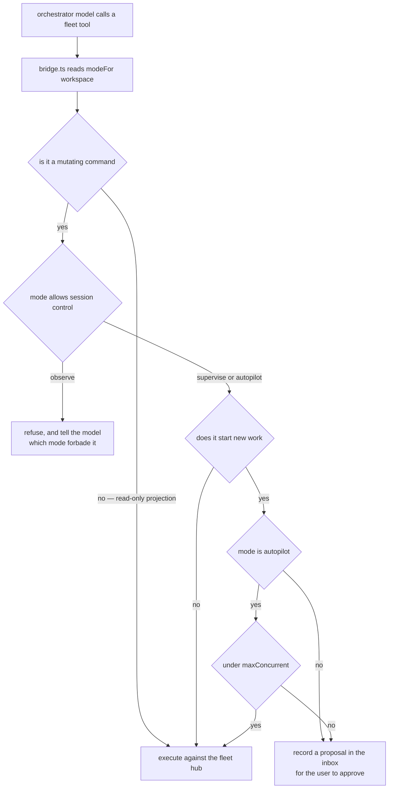

# Orchestration (workspace agents managing session agents)

A workspace runs many sessions at once. Today nothing in pidex knows that:
each session is an island, the home screen is a greeting, and "what is
everything doing right now?" is answered by clicking through the sidebar.

This spec adds three layers, in strict order of cost:

| Layer                | What it is                                                    | Inference cost   |
| -------------------- | ------------------------------------------------------------- | ---------------- |
| **1 · fleet hub**    | Main-process state: what every session is doing, mechanically | **zero, always** |
| **2 · orchestrator** | One pi session per project that can read and drive the fleet  | only when asked  |
| **3 · rules**        | Standing instructions, memory, and an opt-in autopilot        | bounded by rules |

The ordering is the design. Layer 1 answers most of "surface the latest work
across workspaces" with no model in the loop at all; Layer 2 exists for
judgment, not for plumbing; Layer 3 is off by default.

## Rules

- **The hub never runs inference.** It is a projection of events pidex already
  receives. Nothing in Layer 1 spawns a process or spends a token.
- **Nothing here runs a model unless the user asks, with no exceptions.**
  There is no timer, no startup sweep, no event trigger. The orchestrator
  process does not exist until the spark is clicked, and even then it is idle
  until spoken to. Every path that spends tokens is a click: opening the
  orchestrator chat, sending it a message, or pressing "Brief me". A workspace
  that never touches those never runs inference for orchestration at all. See
  [Sweeps](#sweeps-the-only-inference-trigger).
- **No hidden hand.** Every action the orchestrator takes on a session appears
  in that session's transcript, live. See [The visible-hand rule](#the-visible-hand-rule).
- **Autonomy is opt-in and capped.** One axis — `observe` / `supervise` /
  `autopilot` (see [Modes](#modes)). Only `autopilot` may start a session, and
  never more than `maxConcurrent` at once. Enforced in `bridge.ts` at call
  time, so a mode change binds on the next tool call.
- **The orchestrator is a session like any other.** It is spawned through
  `SessionRegistry`, speaks the same RPC, renders in `ChatView`. It is not a
  second agent runtime.

### How a fleet tool call is gated

The mode is read at CALL time, never trusted from the system prompt. The
preamble is fixed when the orchestrator spawns and goes stale the moment the
user switches modes, so a refusal decided in `bridge.ts` is the only version
that is a guarantee rather than a request.



The four mutating commands are `session_send`, `session_stop`,
`session_answer` and `propose_work`; everything else is a read-only projection
and is never gated. `observe` refuses all four. `supervise` allows the first
three but turns `propose_work` into an inbox item. Only `autopilot` starts
work, and never beyond `maxConcurrent`.

A refusal is phrased so the model is told what it may not do and can report
instead of retrying blindly — a silent failure would just get retried.

## Explicitly cut

- **Burn-rate circuit breaker.** The 2026-08-21 runaway was a
  `@saccolabs/pi-claude-cli` resume-prompt bug, fixed in 0.4.6 — not a property
  of normal subscription use. Automating aborts around token rate would be
  building a control system for a defect that no longer exists. `burnRate.ts`
  stays as passive display. Do not re-add this without new evidence.
- **Per-event inference.** Considered and rejected: it makes an always-on
  model the price of opening the app.
- **Autonomous dispatch queue.** The orchestrator gets memory and a _propose_
  action instead; unattended spawning lives behind autopilot only.

---

## Layer 1 — the fleet hub

`electron/orchestrator/fleet.ts`. Subscribes to every live session's
`PiRpcClient` and maintains one normalized record per session. The registry
gains `created` / `disposed` events so the hub attaches without
`pi-session-handlers.ts` having to remember to tell it (any future creation
path is covered for free).

### State

```ts
// shared/models.ts
export type FleetPhase = 'streaming' | 'awaiting-input' | 'idle' | 'error' | 'exited'

export interface FleetQuestion {
  requestId: string
  method: 'select' | 'confirm' | 'input'
  title: string
  message?: string
  options?: string[]
  askedAt: number
}

export interface FleetSession {
  sessionId: string
  workspacePath: string
  diskPath?: string
  title?: string
  phase: FleetPhase
  /** Last assistant prose line, truncated to 160 chars. */
  lastLine?: string
  /** Tool executing right now, if any. */
  currentTool?: string
  /** Best-effort paths this session's tools touched; bounded to 50. */
  filesTouched: string[]
  pendingQuestion?: FleetQuestion
  lastActivityAt: number
  /** Set when phase became 'idle'; powers "waiting 14 min". */
  idleSince?: number
  turns: number
  isOrchestrator: boolean
}

export interface FleetSnapshot {
  sessions: FleetSession[]
  updatedAt: number
}
```

### Event mapping

The reducer is a **pure function** (`fleetReducer(state, event) → state`) so it
is unit-testable without Electron or a subprocess.

| Input                                     | Effect                                                   |
| ----------------------------------------- | -------------------------------------------------------- |
| `agent_start`                             | `phase: 'streaming'`, `turns++`                          |
| `tool_execution_start`                    | `currentTool`, harvest path-ish args into `filesTouched` |
| `tool_execution_end`                      | clear `currentTool`                                      |
| `message_end` (assistant, has text)       | `lastLine` = last non-empty prose line, truncated        |
| assistant `stopReason: 'error'`           | `phase: 'error'`                                         |
| `agent_end` / `agent_settled`             | `phase: 'idle'`, `idleSince: now`                        |
| extension-UI `select`/`confirm`/`input`   | `pendingQuestion`, `phase: 'awaiting-input'`             |
| a reply sent via `pi:extensionUiResponse` | clear `pendingQuestion`                                  |
| `exit`                                    | `phase: 'exited'`                                        |

Cost and token totals are deliberately **not** recomputed here — `SessionMeta`
already carries them from the scanner, and a second cost pipeline is a second
thing to get wrong.

`filesTouched` is best-effort: string args named `path` / `file_path` /
`filePath`. It is a signal, never a claim, and the UI labels it as such.

### Transport

- `fleet:state` (invoke) → `FleetSnapshot`, for first paint.
- `fleet:changed` (push) → `FleetSnapshot`, broadcast to every window with
  `BrowserWindow.getAllWindows()`, matching `fs:changed` and `pty:status`.
  Debounced ~150 ms: a streaming session emits per-token events and the home
  screen must not re-render at that rate.

### Collision detection (free, no model)

Two sessions with the same entry in `filesTouched` is a pure function over the
snapshot — and this repo has the scar to justify surfacing it (P11's log: two
concurrent sessions destroyed each other's uncommitted work). It renders as a
mechanical inbox warning. No orchestrator involvement.

---

## Layer 2 — the orchestrator agent

One pi session per **project** (keyed by `mainRepoPath`, so a worktree and its
main repo share one orchestrator, exactly as the sidebar groups them).
Lazy: nothing spawns until the user clicks the spark.

### Spawning

`electron/orchestrator/manager.ts` calls `registry.create()` with:

- `cwd` = the project's main repo path.
- `extensions` = `bundledExtensions()` **plus** `pi-ext/orchestrator.ts`.
- `appendSystemPrompt` = a fixed preamble (what the fleet is, what the tools
  do, the visible-hand and autonomy rules) **concatenated in main** with the
  contents of the rules file. pi's `--append-system-prompt` accepts text _or_ a
  file path; passing composed text removes the ambiguity and lets the preamble
  exist.

### Identifying an orchestrator session

Two mechanisms, belt and braces, because a missed identification shows up as
the orchestrator masquerading as ordinary work:

1. **Prefs are the fast path.** `orchestratorSessions: Record<string, string>`
   maps main-repo path → the orchestrator's session **file path**. Written once
   the session's path is known, and it doubles as the resume target: `ensure()`
   resumes that path if it still exists, else creates a fresh session. That
   reuses `CreateSessionOptions.sessionPath`, which pidex already does for every
   reopened session — no `--session-id` semantics to depend on.
2. **A name sentinel is the durable fallback.** The session's pi name is set
   (`set_session_name`) to a reserved prefix. The scanner already reads `name`
   into `SessionMeta`, so an orchestrator session stays identifiable after a
   prefs reset, and the prefix is re-applied if a user renames it.

Both feed **one exported predicate**, `isOrchestratorSession(meta)`, which is
the single choke point every consumer must use. Missing one is the bug this
section exists to prevent — see [Differentiation](#differentiation).

### Context hygiene

The orchestrator is **one long-lived session per project**, not a pool and not
a rotating set. Sweeps run in that same thread. Its context is kept honest by
the mechanisms pi already has, both of which pidex already ships:

| Mechanism       | Effect                                      | Status in pidex           |
| --------------- | ------------------------------------------- | ------------------------- |
| auto-compaction | summarizes at threshold, thread continues   | ships; on by default      |
| `/compact`      | summarize now, optionally with instructions | ships (menu + `/compact`) |

That is deliberately the whole list. pi has **no `/clear`** (verified against
0.84.2's `BUILTIN_SLASH_COMMANDS`), and its `/new` — which starts a _different_
session rather than clearing this one — is **not** wired up and should not be:
`new_session` rebinds the live process to a new session file, which would
invalidate the prefs pointer above and strand the renderer's per-session state.
Compaction is sufficient. Continuity that must outlive compaction belongs in
the memory file, not in context.

### The control channel

The orchestrator's tools run inside pi and need to reach main. **They do not
open a socket.** pi's `ExtensionUIContext.input(title, placeholder, opts)`
returns `Promise<string | undefined>` and, in RPC mode, round-trips through the
`extension_ui_request` / `extension_ui_response` pair pidex already implements
(verified against pi 0.84.2: `dist/core/extensions/types.d.ts`, and
`examples/rpc-extension-ui.ts` demonstrates the full loop). So:

```
extension → pidex   extension_ui_request { method: 'input',
                      title: 'pidex-fleet:v1:<command>',
                      placeholder: '<json args>' }
pidex → extension   extension_ui_response { id, value: '<json result>' }
```

`electron/orchestrator/bridge.ts` intercepts requests whose title carries the
sentinel **and whose session is the registered orchestrator for its project**,
handles them, and does not forward them to the renderer. Every other session's
sentinel request is forwarded as an ordinary dialog, so it cannot be used as a
covert channel.

Why this over a local socket: no new listening surface, no token to leak, no
`app.isPackaged` gate to get wrong (compare the standing warning about
`PIDEX_PI_STUB`), and the transport is already exercised by every extension
dialog in the app. Authorization is structural — main knows which session id it
spawned as an orchestrator.

Each call passes `opts.timeout` (20 s) so a wedged main resolves `undefined`
rather than hanging a tool forever. Failures come back as
`{"ok":false,"error":"…"}` and become tool errors, never exceptions.

### Tools

| Tool             | Args                                         | Does                                                       |
| ---------------- | -------------------------------------------- | ---------------------------------------------------------- |
| `fleet_status`   | —                                            | the snapshot, plus on-disk sessions for this project       |
| `session_read`   | `sessionId`, `limit?`                        | recent transcript tail (`get_messages` on the live client) |
| `session_send`   | `sessionId`, `text`, `mode: steer\|followUp` | speak to a running agent                                   |
| `session_stop`   | `sessionId`                                  | `abort`                                                    |
| `session_answer` | `sessionId`, `requestId`, `value`            | resolve a pending clarifying question                      |
| `git_status`     | `sessionId \| path`                          | branch, dirty count, PR state (wraps `git:*` / `gh:*`)     |
| `propose_work`   | `title`, `prompt`, `workspacePath?`          | queue an inbox suggestion — or spawn, under autopilot      |
| `memory_read`    | —                                            | the memory file                                            |
| `memory_write`   | `content`                                    | replace it (whole-file; the model owns its own notes)      |
| `publish_digest` | `DigestPayload`                              | what the home screen and sidebar render                    |

`session_send`, `session_stop`, `session_answer` and `propose_work` are
mutations and are the ones autopilot governs.

### Sweeps: the only inference trigger

A sweep is a prompt main injects into the orchestrator session. Kinds:

- **`brief`** — "what happened, what needs me". The snapshot rides in the
  prompt (a few hundred tokens); tools are available for drill-down.
- **`review`** — the per-session pass: read what each session has been doing,
  check git/PR state, and recommend — _this feature merged, archive the chat_,
  _this one stalled_, _this one drifted from its charter_. This is the case
  that motivated the design: judgment applied deliberately, not continuously.
- **`question`** — a free-form user message; an ordinary prompt.

Triggers: the "Brief me" button, a per-group "Review" action, and (opt-in)
once when a workspace opens. Guards: a minimum interval between automatic
sweeps, and a skip when nothing in the snapshot changed since the last one.
The orchestrator's own session is excluded from the fleet it reports on, so a
sweep cannot trigger itself.

### The digest wire contract

The orchestrator publishes through `ctx.ui.setStatus` — the **same channel**
the context meter already uses ([12-extensions.md](extensions.md#the-status-channel-is-a-wire-contract)),
so no new plumbing. Key: `pidex-orchestrator`.

```ts
export interface DigestItem {
  kind: 'attention' | 'suggestion' | 'note'
  sessionPath?: string
  text: string
  action?: {
    label: string
    kind: 'open' | 'resume' | 'archive' | 'merge' | 'start'
    payload?: string
  }
}

export interface OrchestratorDigest {
  workspacePath: string
  updatedAt: number
  headline: string
  items: DigestItem[]
}
```

Same rules as every other status payload: JSON in a string, the parser returns
`null` on garbage rather than throwing, a missing key renders nothing (never an
empty section), and the emitter swallows its own errors so a status push can
never break a turn.

---

## Layer 3 — rules, memory, autopilot

Both files live in `<mainRepo>/.pidex/`:

- `orchestrator.md` — standing rules, compiled into the system prompt at spawn.
- `orchestrator-memory.md` — the orchestrator's own notes, read and rewritten
  through its memory tools.

**These are personal, not team-shared.** `electron/fs/git-worktrees.ts` adds
`/.pidex/` to `.git/info/exclude`, so anything there is invisible to git. That
is the right default (no repo pollution, no PR noise), but the doc must not
pretend the rules are code-reviewable. A team that wants shared rules commits a
file elsewhere and points the setting at it.

Rules are prose, not config — "if a session idles more than 30 minutes with
uncommitted work, tell me"; "never steer a session that is mid-refactor";
"prefer proposing over acting". They are appended to the preamble verbatim.

```ts
export interface OrchestratorWorkspacePrefs {
  /** False until the user first opens the orchestrator for this project. */
  enabled: boolean
  /** How much it may do on its own: observe | supervise | autopilot. */
  mode: OrchestratorMode
  /** Cap on autopilot-spawned live sessions. */
  maxConcurrent: number
  /**
   * Model for the FIRST spawn only. After that the orchestrator's own picker
   * owns it: pi records `model_change` in the session file and restores model
   * and thinking level on resume, so the choice persists with no pidex state.
   */
  model?: string
}
```

Defaults: `enabled false`, `mode 'supervise'`, `maxConcurrent 2`. Stored per
main-repo path in `AppPrefs`. Installs from before modes carry `autopilot`;
`orchestratorModeOf()` migrates `true` to `autopilot` rather than silently
downgrading.

### Modes

| mode                  | reads fleet | messages / stops / unblocks | starts work                |
| --------------------- | ----------- | --------------------------- | -------------------------- |
| `observe`             | yes         | no                          | no                         |
| `supervise` (default) | yes         | yes                         | proposes only              |
| `autopilot`           | yes         | yes                         | yes, up to `maxConcurrent` |

The mode is **enforced in `electron/orchestrator/bridge.ts` at call time**, not
in the prompt — `BridgeDeps.modeFor` is a function so a switch takes effect on
the orchestrator's very next tool call, with no respawn and no window where the
prompt and the rules disagree. The preamble still states the posture so the
model does not waste turns attempting things it will be refused for, and a
sweep re-states the current mode because the preamble was fixed at spawn.

Switchable from the orchestrator's composer (next to the model picker) and from
Settings → Orchestration.

**There is no "sweep on open" setting.** One was specified and built as a
toggle, then removed before shipping: nothing read it, so it was a control
that promised to spend tokens and did not. More importantly, wiring it would
have broken the guarantee below — that inference happens only when the user
asks for it, with no exceptions to remember.

---

## Differentiation

An orchestration thread manages work; a normal session _is_ work. They must
never be mistaken for each other, in either direction.

**The orchestrator, in the sidebar.** It is not in the session list at all. It
is a fixed control in the workspace group's header, beside the group's other
permanent controls — options (`⋯`), new session (`+`), orchestrator (`✳`) —
so it is reachable whether or not the group is expanded, and never reads as a
task. Right-clicking it opens the actions that keep it debuggable: open, brief,
review, orchestration settings, restart the process (keeps the thread), and
reset the thread (starts fresh).

Its badge counts **orchestrator turns the user has not seen** — incremented
when a turn ends while the thread is not active, cleared on opening it. That is
a different question from the digest's attention count ("what needs you?"), and
a sidebar badge has to answer the first one.

**The orchestrator, when open.** `OrchestratorChat` keeps `ChatView` but changes
its chrome: an accent rail, a header naming the project it manages and the
sessions in scope, its own cost, and a composer placeholder that asks about the
fleet rather than about code. Fleet tool calls render as fleet actions, not as
generic tool cards.

**The other direction — inside worker sessions.** Anything the orchestrator
injected carries an explicit badge in that session's transcript, per
[the visible-hand rule](#the-visible-hand-rule). A user reading a session must
always be able to tell which messages they wrote and which the manager did.

**Everywhere else, one predicate.** `isOrchestratorSession()` gates the sidebar
list, `groupSessionsByProject` and `workspaceStats()` (home tiles + heatmap).

---

## Surfaces

### Home becomes mission control

`src/features/home/WorkspaceHome.tsx`, rebuilt. It renders **across
workspaces**, reusing `groupSessionsByProject` so home and sidebar can never
disagree about what a project is.

1. **Header** — greeting, one line of mechanical truth ("3 agents working · 2
   need you · $4.12 today"), and **Brief me** (sweeps the active workspace).
2. **Needs you** — the inbox. Pending clarifying questions rendered with their
   real options as buttons (answering posts `pi:extensionUiResponse`, exactly
   what `ExtensionDialogHost` does today); finished sessions with a mergeable
   branch; errored sessions; collision warnings. Items with `enabled`
   orchestrators also offer _let the orchestrator decide_.
3. **Per-project groups** — each headed by the digest headline (absent until a
   sweep has run), then session cards: phase dot, title, `lastLine`, cost, and
   an **inline composer** that maps to `steer` while streaming and `follow_up`
   when idle, plus stop/open. Dormant sessions show _Resume_ instead.
4. **Composer** — the existing one, unchanged in behavior.

The stats card and heatmap move below the fold; they are a flourish, and the
fleet is the point.

### Sidebar

The workspace group header (name + caret + plus, in
`src/features/sessions/Sidebar.tsx`) gains a third control: a hub-and-spoke
mark (`OrchestratorIcon`) that opens that project's orchestrator chat. Not a
spark — `✳` is the "pi is working" mark, so using it here made the
orchestrator's identity and every session's busy state the same glyph. Its state doubles
as a light — quiet when idle, filled with a count when the digest holds
attention items. `WorkspaceSwitcher` carries the same control for the active
project.

### The orchestrator chat

`src/features/orchestrator/OrchestratorChat.tsx` wraps the ordinary `ChatView`
with a distinct header: scope (sessions under watch), its own cost, the mode
picker, **Brief me**, and a menu carrying review, rules and settings, restart
and reset. Sweep prompts appear in the transcript as ordinary user messages,
which is honest — they _are_ what was sent.

Those controls live here rather than only on the sidebar icon because of how
they were first shipped: right-click on a 20px target, and nothing at all on
the chat itself. A thread that had bricked itself therefore showed several
identical fatal errors and offered no way out on the screen the user was
actually looking at.

When the thread is in exactly that state, a **stuck bar** sits under the banner
naming the cause and offering the reset — see Recovery below.
`features/orchestrator/threadHealth.ts` decides, and is deliberately narrow: a
transient failure must never suggest throwing away a working thread.

### The visible-hand rule

A message main injects into a session bypasses the renderer, so that session's
open transcript would not show it until reload. `SessionPush` gains
`{ kind: 'injected'; text: string; source: 'orchestrator' }`; `stores/sessions.ts`
turns it into a user message with an orchestrator badge. pi persists it either
way — this only fixes what the live UI shows.

---

## What shipped

All three layers, in one PR. Code map:

| Area               | Files                                                                                                                                                                                         |
| ------------------ | --------------------------------------------------------------------------------------------------------------------------------------------------------------------------------------------- |
| Hub (no inference) | `electron/orchestrator/{fleet,fleetReducer,collisions,broadcast}.ts`, `SessionRegistry` events                                                                                                |
| Control channel    | `electron/orchestrator/{protocol,bridge}.ts`, interception in `ipc/pi-session-handlers.ts`                                                                                                    |
| Orchestrator       | `electron/orchestrator/{manager,prompt,files,instance}.ts`, `pi-ext/orchestrator.ts`                                                                                                          |
| Notifications      | `electron/orchestrator/{notifications,notifier}.ts`, single-instance lock in `main.ts`                                                                                                        |
| Identity           | `shared/orchestratorIdentity.ts` — the one predicate                                                                                                                                          |
| Renderer           | `src/stores/fleet.ts`, `src/features/home/{FleetOverview,FleetInbox,SessionCard,inbox}.*`, `src/features/orchestrator/OrchestratorRow.tsx`, `src/features/settings/tabs/OrchestrationTab.tsx` |
| IPC                | `fleet:state`, `orchestrator:{ensure,sweep,rules,writeRules,overview,setPrefs,acceptProposal}`, `app:setNotificationsMuted`                                                                   |

## Manual test plan

Run `npm run dev` with `pi` on PATH. Everything in **A** costs nothing; **C**
spends tokens and says so. A fresh install starts with no orchestrator
anywhere, which is itself the first thing to check.

### A · The free layer (no model runs)

1. **Home with nothing running** — open a project with no live sessions. Home
   shows the greeting; no fleet section, no digest. Stats are collapsed under
   "Project stats".
2. **A session appears as a card** — start a chat, then click **New** to go
   home. Expect a card with the session's title, its latest line, a phase dot,
   and an inline composer. While it streams the trailing button reads **Stop**;
   once settled it reads **Open**.
3. **Header counts** — the line above the cards reads "1 agent working" while
   streaming and "1 idle" after. It must never say "Nothing running" while a
   card is listed.
4. **Steer from home** — type into a card's composer while the agent is
   streaming and press Enter. The message reaches that session (open it and
   see it in the transcript). Idle sessions take the same box as a prompt.
5. **Sidebar separation** — each project group shows one **Orchestrator** row
   above its sessions, with a ✳ mark and no branch subtitle. It must not
   appear among the session rows.
6. **Blocked session → inbox** — trigger a clarifying question (an extension
   that calls `ctx.ui.select`). Home shows it under **Needs you** with its real
   options as buttons; clicking one answers it without opening the session, and
   the item disappears.
7. **Worktree sessions belong to their project** — with the default "new
   branch" setting on, sessions run in `.pidex/worktrees/`. They must still
   appear under their main repo's group and in that project's fleet.

### B · Orchestrator, no tokens spent

8. **First click explains itself** — click the sidebar spark on a project that
   has never had an orchestrator. It opens a chat; it must not silently start
   a sweep.
9. **The chat is unmistakable** — the orchestrator's view carries an accent
   banner naming the project, how many sessions it is watching, and "manages
   sessions · does not write code". It must never look like an ordinary chat.
10. **It is a real session** — the model picker, `/compact`, and the context
    meter all work in the orchestrator chat exactly as in any other.
11. **It stays out of the numbers** — with an orchestrator thread present,
    check that the home "Project stats" session count does **not** include it.
12. **Settings → Orchestration** — autopilot off by default, cap of 2, brief-on-
    open off, notifications on. The rules box shows `<repo>/.pidex/orchestrator.md`
    and saving reports "Applies next session".

### C · Sweeps (these spend tokens)

12. **Brief me** — with at least one session listed, click **Brief me**. Within
    a minute or two a headline appears under the cards with a ✳. Pick a model
    that is good at tool calling; see "Known behaviours" below.
13. **The prompt is visible** — open the orchestrator chat; the sweep request
    appears as an ordinary user message. Nothing it was asked is hidden.
14. **It can see the fleet** — the sweep prompt lists your sessions with phase,
    idle time, last line and touched files. It must not say "No sessions are
    running" while sessions are listed on the home screen.
15. **Rate floor** — click Brief me twice quickly. The second is refused with a
    visible message, not silently swallowed.
16. **Failure is visible** — point the orchestrator at an unreachable model and
    sweep. An error appears beside the button; the app must not look hung.
17. **Review sweep** — ask the orchestrator directly to review the project. It
    should read transcripts and git state and publish suggestions.

### D · Acting on sessions (spends tokens)

18. **Visible hand** — ask the orchestrator to send a message to a named
    session. That session's transcript shows the message immediately, live,
    attributed to the orchestrator.
19. **It cannot drive itself or others' projects** — ask it to steer its own
    session id: refused. Sessions in another project are not in its
    `fleet_status` at all.
20. **Autopilot gate** — with autopilot off, ask it to start new work. It may
    only suggest. Turn autopilot on in Settings and confirm the cap holds.

### E · Platform

21. **Notifications** — with pidex in the background, cause a session to block
    on a question. A desktop notification appears once (not per event) and the
    dock/taskbar badge shows the count. Muting in Settings silences it.
22. **Single instance** — launch pidex again while it is running. The existing
    window focuses; no second instance starts.

## Known behaviours

- **Sweep quality is the model's.** A capable model is required for tool
  calling. In real runs a local 27B produced a good report but took 2–3
  minutes; Haiku was faster. The sweep prompt now states that publishing is the
  definition of success, because a model that analysed well and never called
  `publish_digest` left the home screen empty.
- **Naming is best-effort.** pi never titles a session and pidex's one-shot
  naming call can time out on slow models; cards and prompts fall back to the
  first user message and the folder name.
- **`.pidex/` is git-excluded** by pidex itself, so rules and memory are
  personal, not team-shared.

## Verification

`npm run validate` green: typecheck, lint, prettier, unit and e2e.

Unit coverage worth knowing about: the reducer's phase transitions (including
that a pending question survives `agent_settled`, and that `message_update`
returns state by reference), every bridge authorization refusal, worktree
scoping, notification coalescing, inbox ranking, the identity predicate, and
that both sweep prompts demand `publish_digest`.

E2E covers the mechanical layer only — the stub runs without pidex's bundled
extensions, so orchestrator tools cannot execute under Playwright. Tool
behaviour is covered by unit tests over `handleFleetCommand` with a fake
registry, and the e2e test says so in its own comment.

Beyond the suite, the whole feature was driven against the real app with real
models (a local Qwen and Haiku): sessions observed, orchestrator opened, tools
called over the control channel, digest published and rendered. That pass found
five bugs the green suite had missed; they are recorded in
[log/2026-08-22-workspace-orchestration.md](log/2026-08-22-workspace-orchestration.md).

## Recovery

A thread can reach a state where it cannot take another turn at all. A model
that emits a malformed tool call gets it persisted into the session file, and
every later turn replays it: Bedrock validates tool names against
`[a-zA-Z0-9_-]+` and rejects the whole request. Observed in production from
MiniMax M2, whose raw tool-call syntax leaked into the name field.

Two mechanisms, because prevention and recovery are different problems:

- `pi-ext/tool-name-guard.ts` (bundled into every session) rewrites the
  finalized assistant message at `message_end`, turning a malformed call into
  plain text before pi persists it.
- `orchestrator:reset` abandons the thread and starts clean, clearing the prefs
  pointer, digest and sweep state. `orchestrator:restart` stops the process but
  keeps the thread, for picking up spawn-time changes.

Without the second, `ensure()` kept resuming the poisoned file and the only
escape was deleting it by hand.

Recovery is only useful if it is reachable. `isPoisonedThreadError` matches the
provider's rejection (a tool-name field _and_ a pattern-constraint failure,
never one alone) and puts the reset in the banner the moment it applies.
`modelRisksMalformedToolNames` names the models observed causing it, and the
orchestrator's model is now selectable in settings — it had a `prefs.model`
that `ensure()` honoured but no UI ever set, so every orchestrator silently
inherited pi's global default, including the model that causes this.

## Sharp edges

- **The control channel rides a UI primitive.** If pi ever makes RPC-mode
  `input` require real interaction, the bridge breaks. The sentinel is
  versioned (`v1`) and the extension surfaces a clear error rather than
  hanging. Re-verify against pi on every protocol bump, alongside
  `shared/rpc.ts`.
- **Authorization is by session id, not by secret.** Keep it that way; a
  sentinel that any session could use would be a covert channel into main.
- **Recursion.** The orchestrator's own session must stay out of the fleet it
  reports on, or a sweep observes itself.
- **Sweeps cost real tokens, and they accumulate in the one thread.** That is
  the accepted trade for keeping a single orchestrator session. Auto-compaction
  bounds it automatically and `/compact` is the manual escape. Sweeps
  are user-initiated by default, rate-floored when automatic, and skipped when
  nothing changed. The orchestrator's context meter and cost are shown in its
  header so neither is invisible.
- **A model with no tool support silently breaks the orchestrator.** Its tools
  simply never get called. The picker must say so; `modelAvailability.ts`
  already handles the separate case of uninvocable Bedrock rows.
- **The first spark click must not spend money.** It opens the chat with an
  explainer and a separate "Run first brief" — never a silent sweep behind a
  button whose label doesn't say it costs.
- **Overlapping sweeps are refused, not queued**, with the running one
  surfaced.
- **Non-git workspaces** have no `mainRepoPath`, so keying falls back to the
  folder and `.pidex/` is not git-excluded there (there is no git).
- **No new unbounded watchers.** The hub listens to processes that already
  exist; it must not add per-file or per-repo watching.
- **`.pidex/` is git-excluded** by pidex itself — rules and memory are personal
  by default. Do not describe them as shared.
- **YOLO still holds.** [00-overview.md](overview.md) forbids approval
  gates on tool calls. Autonomy is tuned through rules and the autopilot
  switch, never by adding per-action confirmation dialogs.

## Deferred

Feature board derived from session + git + PR state; cross-session pre-briefs;
watch expressions; scheduled sweeps beyond workspace-open; a cross-workspace
(global) orchestrator; scope-drift detection as a mechanical signal rather than
a `review` finding.
